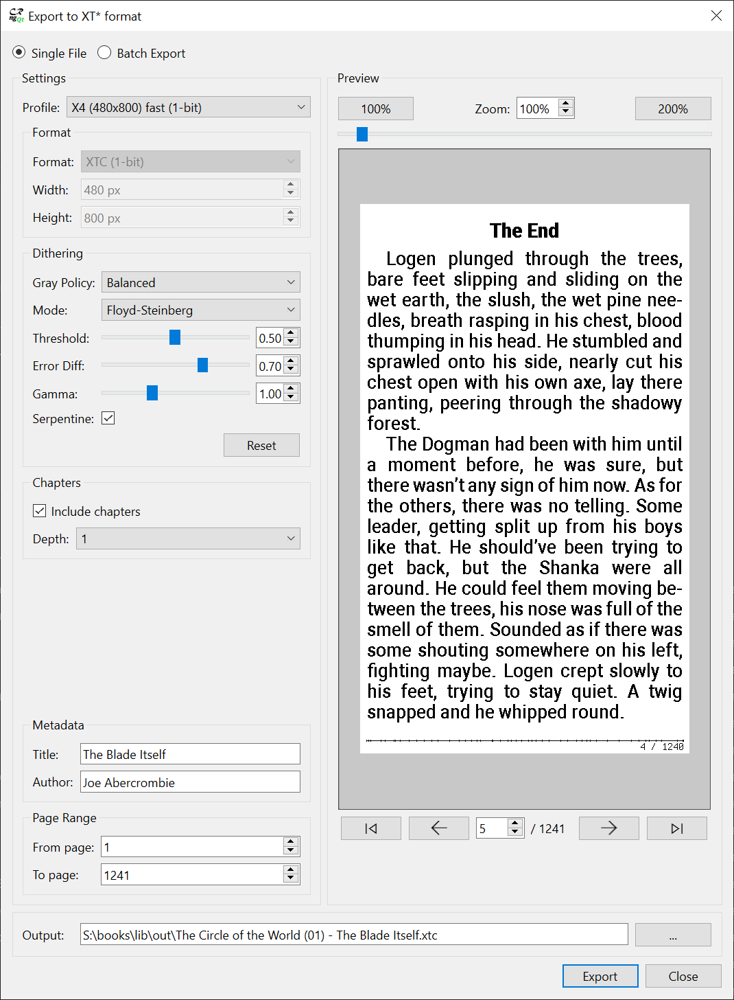
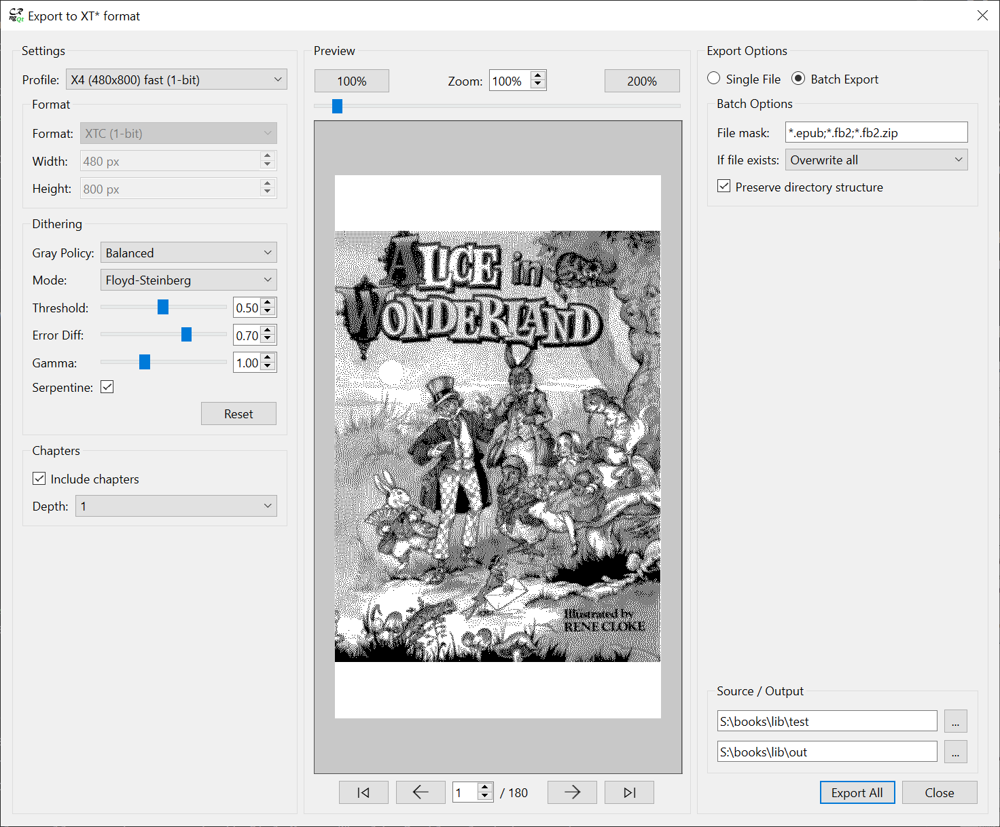

# cr2xt

E-book to XTC format converter based on Cool Reader and crengine.

## About

**cr2xt** is an umbrella project that combines two forked repositories into a unified build:

- **crengine-ng** - Cross-platform C++ library for e-book rendering (backend/engine)
- **crqt-ng** - Qt frontend application

The primary purpose of this project is to convert e-books (EPUB, FB2, MOBI, etc.) into bitmap images optimized for ESP32 e-paper display devices such
as [Xteink X4](https://www.xteink.com/products/xteink-x4).

Xteink X4 is based on ESP32-C3 and only has 400KB RAM, making it challenging to render books with good formatting. The converter renders book pages and exports them to custom container formats (XTC/XTCH) containing monochrome or 4-level grayscale images (XTG/XTH).

XTC Export dialog supports single file and batch export modes.



### Supported Input Formats

The converter supports all e-book formats handled by crengine:

- EPUB, FB2, FB3, MOBI, PRC, AZW
- DOC, RTF, TXT, HTML
- CHM, TCR, PDB
- And more

### Supported Output Formats

See [XtcFormat.md](https://github.com/CrazyCoder/crengine-ng/blob/main/crengine/docs/XtcFormat.md) for the format specification provided by Xteink.
Also check `*.ksy` files in the same folder for [Kaitai Struct](https://kaitai.io/) format specification. These can be used to automatically generate parsers for different languages.

## How to Use

### Windows release builds

Download the latest release version from the [Releases](https://github.com/CrazyCoder/cr2xt/releases) page.

- Unpack and run `crqt.exe`
- File | **Open** and select your e-book file
- File | **Settings** (F9) to access formatting and font settings (or Settings from the context menu)
- File | **Export** (Ctrl+S) to open the export dialog (or use Export from the context menu)

Export preview supports mouse wheel scrolling and zooming (with Ctrl+Mouse Wheel). Double-click to reset zoom.

### macOS release builds

Download the DMG from the [Releases](https://github.com/CrazyCoder/cr2xt/releases) page.

**Important:** The app is ad-hoc signed (not notarized by Apple). macOS Gatekeeper will block it on first run. To open:

1. **Option A** - Right-click method:
   - Right-click (or Control-click) on `cr2xt.app`
   - Select **Open** from the context menu
   - Click **Open** in the dialog that appears

2. **Option B** - System Settings:
   - Try to open the app normally (it will be blocked)
   - Go to **System Settings** → **Privacy & Security**
   - Scroll down and click **Open Anyway** next to the cr2xt message

3. **Option C** - Terminal (removes quarantine flag):
   ```bash
   xattr -cr /Applications/cr2xt.app
   ```

After allowing once, the app will open normally.

Stock firmware renders 2-bit grayscale images too slowly, it's recommended to use 1-bit monochrome mode.

### Tips

- Try to find a font that looks best without antialiasing (Verdana, Tahoma, Roboto, old fonts with good hinting)
- Play with the font size / weight and avoid synthetic weights (Roboto family supports all weights natively)
- Some fonts work better with Autohinting (Roboto), others work better with Bytecode (Verdana)
- Adjust page margins and interline spacing to fit as many lines as possible but so that it's still comfortable to read
- Disable page number / page counter and other text in the header to save vertical space
- Further adjust header navigation bar margins for minimal look
- Use Settings | Stylesheet to adjust element margins and justification
- For advanced users, enable "Use expanded CSS file" and edit the `<format>-expanded.css` file, changes will be applied on the fly
- View | **Rotate** (Ctrl+R) to change orientation (portrait or landscape)

### Export Dialog Features

- **Batch export** - Convert multiple files at once (with file mask filtering and recursive folder processing)
- **Profile-based settings** - Pre-configured profiles for XTC (1-bit) and XTCH (2-bit) formats
- **Live preview** - See exactly how each page will look after export
- **Dithering options** - Floyd-Steinberg, ordered dithering, or none
- **Page range selection** - Export specific page ranges
- **Chapter support** - Include table of contents in export
- **Metadata editing** - Customize title and author

## Differences from crqt-ng / crengine-ng

This project is a **converter-focused fork** with several key differences:

### UI Changes

- New formatting and preview options for fine-tuning font rendering
- More options for footer / header customization (custom margins)
- Individual left/right/top/bottom page margins
- Space width / letter spacing
- CSS stylesheets export for manual editing and full customization
- XT* Export dialog with preview and batch mode
- Preserve last settings tab
- Use current page contents for Style Preview
- Default window size adjusts to the export resolution from the profile

### Backend Changes

- Advanced dithering options for images
- Page header / footer rendering customization
- XTC converter

## TODO

### Planned features

- [ ] cr2xt CLI converter
- [ ] Docker image with CLI converter
- [x] macOS builds
- [ ] Linux builds
- [ ] Unofficial compression for XTC format to be used in custom firmwares
- [ ] New custom XTB format with compression

## Building

The project requires:

- Qt6 (Core, Gui, Widgets modules)
- CMake 3.16+
- C++17 compatible compiler
- freetype / fontconfig and other dependencies for crengine

**Windows (MSYS2/MinGW64):**

Use `scripts/build-dist-windows.ps1` or manually run the following commands:

```bash
# Configure
cmake -B build/release -G Ninja \
    -DCMAKE_BUILD_TYPE=Release \
    -DUSE_QT=QT6 \
    -DUSE_COLOR_BACKBUFFER=OFF \
    -DGRAY_BACKBUFFER_BITS=2

# Build
cmake --build build/release --target all -j$(nproc)

# Install
cmake --build build/release --target install
```

**Linux:**

```bash
cmake -B build/release \
    -DCMAKE_BUILD_TYPE=Release \
    -DUSE_QT=QT6 \
    -DUSE_COLOR_BACKBUFFER=OFF \
    -DGRAY_BACKBUFFER_BITS=2

cmake --build build/release -j$(nproc)
```

## License

This project inherits the licenses from its upstream components:

- crengine-ng: GPL-2.0
- crqt-ng: GPL-2.0

## Acknowledgments

- [Cool Reader](https://github.com/buggins/coolreader) - Original Cool Reader / crengine project by @buggins (Vadim Lopatin)
- [crqt-ng](https://gitlab.com/coolreader-ng/crqt-ng) - Next-generation Qt Cool Reader frontend fork by Aleksey Chernov
- [crengine-ng](https://gitlab.com/coolreader-ng/crengine-ng) - Next-generation crengine fork by Aleksey Chernov
